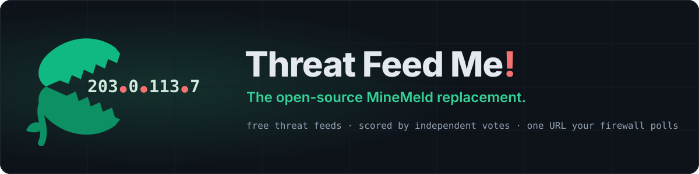

<p align="center">
  
</p>

# Threat Feed Me!

On-prem threat intelligence aggregator that normalizes, dedupes, and scores threat feeds into confidence tiers — then serves them as one URL your firewall polls. Feed it threats. It's always hungry.

## Deploy

Designed to run on a small on-prem box or VM with no tuning and no API keys.

**Fastest — run the published image** (nothing to clone or build):

```bash
docker run -d --name threat-feed-me -p 8080:8080 \
  -v threatfeedme-data:/app/data alexlinos/threat-feed-me:latest
# then open the dashboard at http://<this-server-ip>:8080
```

**Or with docker compose** (clone first — gives you `config.yaml` to edit):

```bash
git clone https://github.com/alexlinos/threat-feed-me.git
cd threat-feed-me
docker compose pull      # use the published image ...
docker compose up -d     # ... or `up -d --build` to build from source instead
```

Then open the dashboard and copy the **"Medium confidence"** feed URL into your
firewall's threat-feed setting (FortiGate, Sophos, SonicWall, Palo Alto, Cisco,
pfSense, ...).

That's it. On first start it fetches **15 free, keyless threat feeds**, dedupes
and scores them, and begins serving block lists. It **auto-refreshes every 60
minutes** — no cron, no maintenance. Everything stays on-prem; feeds are pulled
inbound only.

- **No accounts or keys required** for the default feeds.
- The dashboard shows the exact URLs to paste, per confidence tier, with a
  Copy button and firewall-specific instructions.
- Add your own feeds, upload a custom list, whitelist false positives, or force
  a refresh — all from the dashboard, no config editing.
- A few feeds ship **disabled** (the auth-walled ThreatFox export — a keyless
  ThreatFox mirror is enabled by default — AlienVault OTX, a sample custom
  list); enable them from the dashboard once configured. Feeds
  that need an API key (like OTX) have a **Set key** button — the key is
  stored server-side in the data volume's `.env`, applied immediately, and
  never displayed back.

To protect the dashboard on an untrusted network, set `DASHBOARD_USER` /
`DASHBOARD_PASSWORD` and `dashboard.auth_required: true`. Feed URLs stay open so
firewalls can poll them.

## Features

- **Feed Aggregation**: Pull from multiple sources (OSINT, commercial, custom)
- **Runtime feed management**: Add, remove, enable/disable, and mix-and-match
  feeds from the dashboard — including your own custom URL or local-file feeds
- **Force refresh, scheduling & retention**: Refresh all feeds (or one) on
  demand, set the auto-refresh interval (default 60 minutes), and set how long
  an IP is kept after it drops out of every feed (default 7 days; `0` = keep
  forever) — all from the dashboard toolbar, no restart needed
- **Deduplication**: Merge duplicate IPs across feeds with source tracking
- **Confidence Scoring**: High/Medium/Low tiers based on:
  - **Effective independent votes** — sources are discounted by their
    measured overlap so echoing feeds count as one witness, and tier
    boundaries are found from the live vote distribution rather than fixed
    thresholds. Full algorithm:
    [How confidence tiering works](#how-confidence-tiering-works).
  - Feed reputation — equal for every feed by default and *earned* from there:
    flagging false positives automatically lowers the offending feed's weight
  - Age decay
- **Whitelist Management**: Override false positives — globally (all feeds) or
  scoped to a single feed (ignore one noisy source while trusting the rest).
  The whitelist dialog shows which feed(s) reported the IP, and a reason
  (false positive / risk accepted / internal asset). Flagging a **false
  positive** lowers that feed's reputation, so a noisy feed's IPs score lower
  and drop out of the higher-confidence firewall feeds (self-heals when the
  whitelist entry is removed). Click a feed's **⚠ N FP** badge to review what
  it was penalized for and forgive individual flags or all of them — the
  whitelist entries stay in place, only the blame is withdrawn.
- **Multi-format Export**: Text files, CSV, JSON for firewall/SIEM integration
- **Basic Dashboard**: Web UI for viewing feeds, managing whitelists, seeing stats
- **Containerized**: Docker deployment for easy on-prem install

## Architecture

```
┌─────────────────────────────────────────────────────────────┐
│                       Threat Feed Me!                       │
├─────────────────────────────────────────────────────────────┤
│  Feed Ingestion Layer (free, keyless defaults)             │
│  ├── Talos (Snort.org IP block list, via scraper)          │
│  ├── DShield/SANS + Spamhaus DROP (netblock feeds)         │
│  ├── Emerging Threats (compromised + block IPs)            │
│  ├── Blocklist.de, CINS Army, GreenSnow, BBcan177          │
│  ├── DataPlane, BruteForceBlocker, Turris, BinaryDefense   │
│  ├── abuse.ch ThreatFox mirror (botnet C2 IOCs)            │
│  ├── AbuseIPDB top-reported (community abuse reports)      │
│  ├── Optional: AlienVault OTX (ships disabled)             │
│  └── Custom Feeds (user-defined, e.g. local honeypot)      │
├─────────────────────────────────────────────────────────────┤
│  Processing Engine                                          │
│  ├── Normalization (common schema)                         │
│  ├── Deduplication (IP-based with source tracking)         │
│  ├── Confidence Scoring (multi-factor)                     │
│  └── Whitelist Filtering                                    │
├─────────────────────────────────────────────────────────────┤
│  Output Tiers                                               │
│  ├── High: >2 independent votes + threat-intel validated   │
│  ├── Medium: >1 independent vote (overlap-discounted)      │
│  └── Low: all deduped IPs (including custom)               │
├─────────────────────────────────────────────────────────────┤
│  Storage                                                    │
│  └── SQLite (IPs, sources, scores, whitelist, metadata)    │
└─────────────────────────────────────────────────────────────┘
```

## How confidence tiering works

*(v1.8.0+ — the "effective votes" algorithm; set `scoring.tiering.method:
legacy` in `config.yaml` for the old fixed thresholds.)*

**The one-sentence version.** An IP is dangerous only if *independent*
sources agree on it — so we count **effective votes**, not raw sources, and
draw the High/Medium/Low lines from the shape of the vote distribution so the
tiers stay meaningful as the feed roster changes.

**The problem, in plain terms.** Treat every feed as an independent witness
and you get fooled. Public feeds aren't independent: Emerging Threats bundles
Spamhaus DROP and DShield into its own list, BBcan177 re-publishes other
lists, and community feeds share reporters. So the same dataset echoed by
three feeds looks like three-way corroboration — and every redundant feed you
add inflates the counts until "High confidence" holds more IPs than Medium.
That's a lie in your blocklist.

**The fix, as three questions.** Instead of trusting the raw count, each IP
goes through three checks:

1. **Is this a real agreement?** *(overlap discount)* — We measure how much
   each pair of feeds overlaps. Two feeds that are 90% the same list are one
   witness, not two. Their votes get heavily discounted; near-disjoint feeds
   keep full weight. So `spamhaus_drop + et_block + bbcan177` agreeing on a
   DROP range is worth ~1.1 votes, not 3.
2. **Is the witness reliable?** *(reputation weight)* — Every feed starts at
   full weight (1.0). Flag a false positive from the dashboard and that feed's
   weight drops automatically, so its IPs score lower until you stop seeing
   mistakes from it.
3. **Is the sighting fresh?** *(recency weight)* — A scan from three days ago
   matters less than one from an hour ago. Age halves an indicator's score
   every 72 hours.

**Where the tier lines come from.** After those weights, every IP has one
number: its *effective votes* (how many genuinely independent, reputable,
fresh witnesses it has). We then look at the shape of all those numbers —
find the natural gaps in the crowd — and draw the cut lines there:

- **Medium** — more than one real, independent vote: corroborated by
  something non-redundant.
- **High** — more than two independent votes, plus at least one curated
  threat-intel feed (`require_threat_intel`). The cleanest list.

A fresh or tiny database falls back to exactly these floors.

**Why the lines stay put.** Recomputing tier boundaries every hour would
silently re-bucket live firewall IPs as feeds age in and out (e.g. AbuseIPDB's
3-day list cycling) — churn you'd see as noise in your blocklist. So the
boundaries are held stable and only redrawn when the vote distribution
*actually* moves: any decile drifts past a threshold, or a feed is added,
removed, or resized. Stable week-to-week, responsive when the threat
landscape genuinely changes.

**What you'll observe.** Twin feeds stop double-counting; adding a redundant
feed changes almost nothing; adding a genuinely novel source moves tiers.
Each indicator's vote count is stored in the `effective_votes` column, so you
can inspect why an IP landed where it did.

## Run from source (without Docker)

For development, or to run without containers. The Docker paths under
[Deploy](#deploy) are the quick way; this is the manual alternative.

```bash
# Clone and setup
git clone https://github.com/alexlinos/threat-feed-me.git
cd threat-feed-me

# Install the package (and its dependencies)
pip install -e .

# Run initial feed fetch
python -m threatfeedme.main --fetch

# Generate output feeds
python -m threatfeedme.main --export

# Start dashboard
python -m threatfeedme.dashboard
```

> **Note:** run this way, the dashboard binds to `dashboard.host` / `dashboard.port`
> from `config.yaml` — **`127.0.0.1:8080` by default**, i.e. localhost only. To
> reach it from another machine, set `dashboard.host: 0.0.0.0` (the Docker
> entrypoint already binds `0.0.0.0:8080`, so this note doesn't apply there).

## Using the feeds in your firewall

Start the dashboard (`python -m threatfeedme.dashboard` or via Docker) and open it in a
browser. Each confidence tier is published as a live URL you can paste directly
into your firewall's external threat-feed / block-list setting:

```
http://<server>:8080/feeds/high.txt      # independent sources agree (strictest)
http://<server>:8080/feeds/medium.txt    # corroborated (recommended)
http://<server>:8080/feeds/low.txt       # seen once (high volume)
http://<server>:8080/feeds/all.txt       # everything, deduplicated
```

Each URL returns plain text, one IP or CIDR per line, generated live with the
whitelist applied. `.csv` and `.json` variants are also available for SIEM use.

- **FortiGate:** Security Fabric → External Connectors → Create New → *IP Address Threat Feed*
- **Sophos Firewall** (SFOS 21.0+): Active threat response → Third-party threat feeds → Add (type IPv4, action Block)
- **SonicWall** (SonicOS 7): Object → Match Objects → Dynamic External Object (HTTPS URL)
- **Palo Alto:** Objects → External Dynamic Lists → *IP List*
- **Cisco Secure Firewall (FMC):** Objects → Object Management → Security Intelligence → Network Lists and Feeds
- **Check Point** (R81+): Security Policies → Threat Prevention → Custom Policy Tools → Indicators → External IOC Feed
- **pfSense (pfBlockerNG):** Firewall → pfBlockerNG → IPv4 → add the URL as a source
- **OPNsense:** Firewall → Aliases → URL Table (IPs)

### Custom lists

Add your own feeds from the dashboard: a remote **URL feed**, or **upload a list**
(one IP/CIDR per line). Uploads are stored server-side under `data/uploads/`,
capped at 5 MB, text-only, validated to contain at least one IP/CIDR, and the
storage path is boundary-checked so a filename can never escape that directory.

**Restore defaults:** the dashboard's *Restore default feeds* button re-adds the
curated feeds from `config.yaml` that are missing, without touching feeds you've
customized.

### Merged indicators

The dashboard's *Merged indicators* section shows the deduplicated result across
all feeds (searchable and paginated). You can:
- **Add** an IP or CIDR manually (recorded under a `manual` source)
- **Remove** an IP — this globally whitelists it so a feed refresh won't bring
  it back, and drops it from the served feeds immediately

Feed endpoints are unauthenticated by design (a firewall polling a block list
can't present credentials); the dashboard/API can be protected with optional
Basic auth (`auth_required: true` plus `DASHBOARD_USER`/`DASHBOARD_PASSWORD`).

### Backups

The database is backed up automatically (online, WAL-safe) on the schedule set
in `config.yaml` under `database.backup` (default: every 24h, keep 7, to
`data/backups/` — on the same persistent volume). Trigger one on demand with
`POST /api/backup` or `python -m threatfeedme.main --backup`. **Restore:** stop the app and
copy a backup file over `data/threatfeedme.db`.

## Upgrading

Running the published image? Pull the new one:

```bash
docker compose pull && docker compose up -d
```

Building from source? Rebuild in place:

```bash
git pull
docker compose up -d --build
```

That's the whole procedure — **your data survives updates**. The database
lives on the `threatfeedme-data` volume, so whitelist entries, false-positive
feedback, scores, feed history, and accumulated indicators (e.g. the rolling
multi-day union of DShield netblocks) all carry over. Never delete the volume
to upgrade.

Changes to the *shipped default feeds* are merged into your database
automatically on startup:

- **New default feeds** are added.
- **Changed defaults** (e.g. an upstream URL moved) are updated — but only if
  you never customized that feed. Any edit you made (URL, weight, interval,
  enable/disable) exempts the feed from automatic updates permanently.
- **Feeds you deleted stay deleted.** An update never resurrects them; the
  dashboard's *Restore default feeds* button brings them back explicitly.

Schema migrations run automatically and are additive. Running from a plain
checkout instead of Docker? Same story: `git pull` never touches the `data/`
directory.

## Releasing (maintainers)

Publishing the Docker image is automated by
[`.github/workflows/docker-publish.yml`](.github/workflows/docker-publish.yml):

1. Bump `version` in `pyproject.toml` (the workflow refuses to publish if the
   tag and that version disagree).
2. `git tag v1.2.0 && git push origin v1.2.0`

The workflow runs the test suite, then builds and pushes `linux/amd64` +
`linux/arm64` images tagged with the version and `:latest`. Pushes to `main`
deliberately do *not* publish — `:latest` tracks releases, not every commit.
A manual run (Actions → Publish Docker image → Run workflow) can rebuild
without cutting a tag, e.g. to pick up a base-image security update.

Requires repository secrets `DOCKERHUB_USERNAME` and `DOCKERHUB_TOKEN` (a
Docker Hub *access token* with Read/Write scope, not the account password).

## Configuration

Edit `config.yaml` to customize:
- Feed sources and update intervals
- Confidence scoring weights
- Whitelist rules
- Export formats and paths
- **Retention** (`retention.max_age_days`, default **7**) — how long an IP is
  kept after it was last seen in *any* feed. Because `last_seen` is refreshed
  whenever any feed re-reports an IP, this mostly evicts transient high-churn
  entries (scanners, brute-force) while continuously-listed feeds stay put. Set
  `0` to keep indefinitely.

Values in `config.yaml` are the **seed defaults**. Runtime-adjustable settings —
the auto-refresh interval and the retention window — can be changed live from
the dashboard toolbar (or `POST /api/settings`); the stored value then takes
precedence over the file, so it survives restarts without editing config.

## License

MIT

## Geo attribution

The dashboard's blocked-IP country heatmap uses the free
[DB-IP](https://db-ip.com) IP-to-Country Lite database, distributed under the
Creative Commons Attribution license (CC-BY). Country lookups are bucketed to
/16 granularity and shipped as a compact offline table
(`src/threatfeedme/geo/country-buckets.geo1`); no external geo service is
called at runtime. Attribution: **country data © DB-IP (db-ip.com), CC-BY.**

Country borders for the choropleth come from
[Natural Earth](https://www.naturalearthdata.com/) (1:110m Admin 0), which is
in the **public domain**. They are simplified at build time into
`src/threatfeedme/static/world-paths.json` (~65 KB, ~25 KB gzipped) and
fetched by the browser only when the heatmap panel is expanded.

Regenerate either artifact with:

```bash
python -m threatfeedme.geo.generate --dbip dbip-country-lite.csv
python -m threatfeedme.geo.generate_map ne_110m_admin_0_countries.geojson
```
