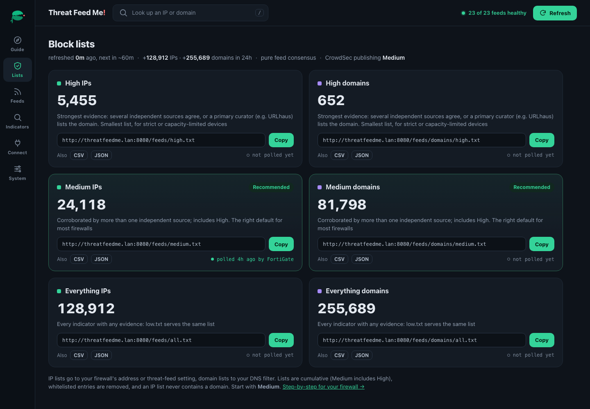
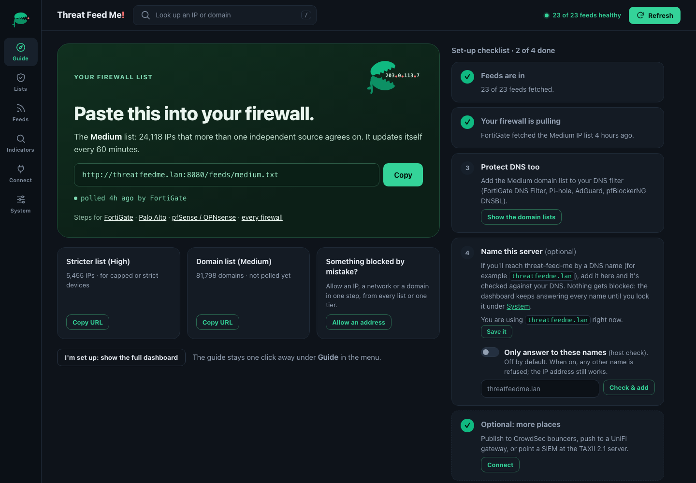
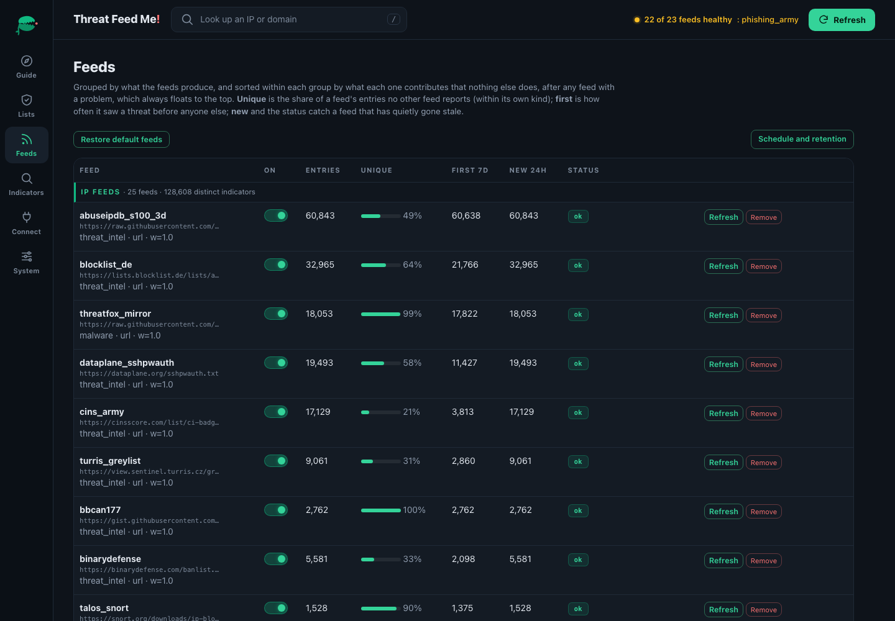
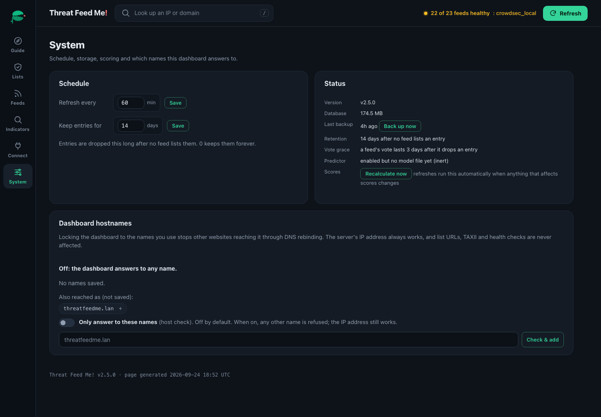

<p align="center">
  
</p>

# Threat Feed Me!

**The open-source MineMeld replacement.** An on-prem threat-intelligence
aggregator that pulls 22 free, keyless feeds, works out which indicators
*independent* sources genuinely agree on, and serves the result the way your
security stack consumes it: block-list URLs for firewalls and DNS filters,
TAXII 2.1 for SIEMs, and direct publishing to CrowdSec bouncers and UniFi
gateways. One container, no accounts, no API keys. Feed it threats. It's
always hungry.

- **Consensus, not just aggregation.** Public feeds copy each other, so raw
  source counts lie. Threat Feed Me discounts overlapping feeds, weighs each
  feed by its false-positive record, and draws High / Medium / Everything from
  the actual shape of the evidence ([how](#how-confidence-tiering-works)).
- **Served every way you need it.** Plain-text URLs any firewall can poll
  (FortiGate, Palo Alto EDL, pfSense, OPNsense, Sophos, SonicWall, Check Point,
  Cisco), domain lists for the DNS filter, CSV/JSON, and a read-only
  **TAXII 2.1** server of STIX 2.1 Indicators.
- **Pushes where polling can't.** Publishes your chosen tier to **CrowdSec**
  (every bouncer you run enforces it) and to **UniFi** gateways, and pulls
  CrowdSec's own detections back in as votes.
- **Safe by default.** A poisoned upstream can't make your firewall block its
  own network: private, reserved and known-good infrastructure is filtered out
  of every list, and whitelists apply everywhere, per tier or per feed.
- **Knows when something's wrong.** Per-feed health, uniqueness and overlap,
  "last polled by FortiGate" beside every URL, and nothing phones home.

<p align="center">
  
</p>

**New in 2.5 "Flytrap":** a redesigned dashboard with a guided first-run set-up,
a TAXII 2.1 server, CrowdSec in both directions, votes that expire when a feed
drops an indicator, "last polled by" proof on every URL, and a MineMeld
migration path. See [Upgrading to 2.5](#upgrading) before you pull it: High
gets smaller on purpose.

### Coming from MineMeld?

Palo Alto Networks retired MineMeld (the hosted version reached end of life on
1 August 2021) and archived the open-source project in March 2023. Threat Feed
Me covers the job most MineMeld deployments did, aggregate public intel and
hand it to firewalls and SIEMs, with less to maintain:

| MineMeld | Threat Feed Me |
|---|---|
| Miners, one per feed | 22 curated feeds built in, plus any URL or uploaded list you add from the dashboard |
| Aggregator processors (dedupe, merge) | Dedupe across feeds, then overlap-discounted consensus scoring into confidence tiers |
| Whitelist miners | Whitelist by IP, CIDR, domain or `*.wildcard`, scoped globally, per feed or per tier |
| EDL feed outputs (PAN-OS) | `/feeds/{high,medium,all}.txt` and `/feeds/domains/...`: plain one-per-line lists that PAN-OS External Dynamic Lists and every other firewall accept |
| TAXII miners (TAXII 1.x feeds) | TAXII **2.1** collections as feeds: MISP, OpenCTI or any TAXII 2.1 server |
| TAXII DataFeed output (TAXII 1.1 / STIX 1.x) | TAXII **2.1** / STIX **2.1**, read-only, six collections |
| Office 365 / AWS / Azure / GCP miners (allow-lists) | Not yet: application lists are on the [2.6 roadmap](ROADMAP.md) |
| Node graph you wire and maintain | Nothing to wire: add a feed, it votes |

What it doesn't do (yet): the Office 365 and cloud IP-range allow-lists (2.6),
arbitrary processing graphs, TAXII 1.x, writes over TAXII, syslog-driven lists,
or pushing PAN-OS Dynamic Address Groups. The
[migration guide](https://alexlinos.github.io/threat-feed-me/minemeld.html)
goes through every common MineMeld use. If you need a full threat-intel platform with case
management, look at OpenCTI or MISP; Threat Feed Me is the lightweight piece
that turns public intel into lists your devices enforce.

## Deploy

Designed to run on a small on-prem box or VM with no tuning and no API keys.

**Fastest: run the published image** (nothing to clone or build):

```bash
docker run -d --name threat-feed-me -p 8080:8080 \
  -v threatfeedme-data:/app/data alexlinos/threat-feed-me:latest
# then open the dashboard at http://<this-server-ip>:8080
```

**Or with docker compose** (clone first, giving you `config.yaml` to edit):

```bash
git clone https://github.com/alexlinos/threat-feed-me.git
cd threat-feed-me
docker compose pull      # use the published image ...
docker compose up -d     # ... or `up -d --build` to build from source instead
```

Then open the dashboard. A fresh install opens on the **set-up guide**: copy
the **Medium** URL into your firewall's threat-feed setting (FortiGate, Sophos,
SonicWall, Palo Alto, Cisco, pfSense, ...) and the checklist ticks itself off as
your firewall starts polling. The [walkthrough](#walkthrough) below shows every
screen.

That's it. On first start it fetches **22 free, keyless threat feeds** (16 IP
feeds and 6 domain feeds: URLhaus, OpenPhish, Phishing Army, HaGeZi TIF,
Phishunt, and the DRB-Ra C2 list),
dedupes and scores them, and begins serving block lists. It
**auto-refreshes every 60 minutes**, no cron, no maintenance. Everything stays
on-prem; feeds are pulled inbound only.

- **No accounts or keys required** for the default feeds.
- The dashboard shows the exact URLs to paste, per confidence tier, with a
  Copy button, firewall-specific instructions, and proof that your firewall is
  actually polling each one.
- Add your own feeds, upload a custom list, whitelist false positives, or force
  a refresh, all from the dashboard, no config editing.
- A few feeds ship **disabled**, opt-in from the dashboard once configured:
  AlienVault OTX and the two HoneyDB feeds (free API keys required), the
  auth-walled abuse.ch ThreatFox export (the keyless ThreatFox IOC mirror
  covers it and ships enabled), CERT.PL, HaGeZi fake, ThreatView domains,
  joewein, PhishTank online-valid, and a sample custom honeypot list.
  Feeds that need API credentials have a **Set key** button: it prompts for each
  required credential (HoneyDB takes an id and key pair), stores them
  server-side in the data volume's `.env`, applies them immediately, and
  never displays them back.

To protect the dashboard on an untrusted network, set `DASHBOARD_USER` and
`DASHBOARD_PASSWORD` in the environment (e.g. in `docker-compose.yml`); setting
both turns auth on — no config edit needed, so it works with the published
image. Feed URLs stay open so firewalls can poll them.

## Walkthrough

The dashboard is one page with five views in the left rail (Guide, Lists,
Feeds, Connect, System), plus the Indicators page. Press <kbd>/</kbd> anywhere
to look up an IP or domain.

**1. Guide (first run).** Until a firewall has polled one of your IP lists, the
dashboard opens here. The left side is the one URL most people need (the
Medium IP list) with a Copy button; the right side is a checklist that answers
itself from what the server can see: feeds fetched, a firewall pulling the IP
list, a DNS filter pulling the domain list. **Name this server** is optional:
if you'll reach the box by a DNS name (say `threatfeedme.lan`), add it and the
server checks whether the name resolves, and to this machine. Saving a name
never blocks anything; the host check stays off until you switch it on.
Click **I'm set up** when you're done, and the Lists view becomes the default
(the guide stays one click away).

<p align="center"></p>

**2. Lists.** Six cards, one per URL: High, Medium and Everything, for IPs and
for domains. Each shows how many entries it serves right now, the URL with a
Copy button, CSV and JSON variants, and the last poll (*polled 3m ago by
FortiGate*). A mistyped URL fails silently on most firewalls; *not polled yet*
is how you find out. The line under the title is the ops pulse: last refresh,
what arrived in 24 hours, your overrides, and push status for CrowdSec and
UniFi when they're configured. The top bar says how many feeds are healthy and
names the first one that isn't.

**3. Feeds.** Every source in one table, IP feeds and domain feeds grouped
apart, with problems floated to the top. Per feed: entries, the share nobody
else reports (*unique*), how often it saw a threat first, what's new in 24
hours, health, and false-positive flags. Add a URL feed or upload a list at the
bottom; the overlap map, country heatmap and problem-TLD panel sit under
*Insights*.

<p align="center"></p>

**4. Connect.** Step-by-step placement for every supported firewall and DNS
filter, the TAXII 2.1 discovery URL for your SIEM, and the CrowdSec and UniFi
panels (both push after every refresh, because neither can poll).

**5. System.** Refresh interval and retention, database size, backups (with
**Back up now**), vote grace, the predictor's state, a **Recalculate now**
button, and **Dashboard hostnames**: the names the dashboard has been reached
by, the names you've saved, and the switch that locks it to them (see
[Upgrading](#upgrading)).

<p align="center"></p>

**Indicators** is the searchable, paginated corpus with per-indicator tier,
score, votes and sources, and the whitelist (by IP, CIDR, domain or
`*.wildcard`, everywhere or per tier).

## Features

- **Feed Aggregation**: Pull from multiple sources (OSINT, commercial, custom
  including [HoneyDB](https://honeydb.io) honeypot telemetry: the community
  network and, if you run sensors, your own honeypots voting as a source)
- **Two indicator kinds, never mixed** *(v2.0)*: IP/CIDR feeds for the packet
  filter and domain feeds for the DNS filter (FortiGate DNS filter, Pi-hole,
  AdGuard Home, pfBlockerNG DNSBL, Unbound). Feeds *declare* their kind;
  domains are never sniffed out of IP feeds, an IP URL never contains a
  domain, and both kinds get their own tier boundaries (a domain vote
  distribution would otherwise set the IP tier lines, or vice versa).
  Domain safety floor: special-use TLDs (`.test`, `.local`, ...) are rejected
  and a curated core of OS-update/CDN/mail infrastructure (plus your own
  `safety.known_good_domains`) can never be blocked, subdomains included.
- **Runtime feed management**: Add, remove, enable/disable, and mix-and-match
  feeds from the dashboard, including your own custom URL or local-file feeds
- **Force refresh, scheduling & retention**: Refresh all feeds (or one) on
  demand, set the auto-refresh interval (default 60 minutes), and set how long
  an IP is kept after it drops out of every feed (default 7 days; `0` = keep
  forever), all from the dashboard's System view, no restart needed
- **Deduplication**: Merge duplicate IPs across feeds with source tracking
- **Confidence Scoring**: High/Medium/Low tiers based on:
  - **Effective independent votes**: sources are discounted by their
    measured overlap so echoing feeds count as one witness, and tier
    boundaries are found from the live vote distribution rather than fixed
    thresholds. Full algorithm:
    [How confidence tiering works](#how-confidence-tiering-works).
  - Feed reputation, equal for every feed by default and *earned* from there:
    flagging false positives automatically lowers the offending feed's weight
  - Age decay
- **Whitelist Management**: Override false positives, globally (all feeds) or
  scoped to a single feed (ignore one noisy source while trusting the rest).
  Accepts IPs, CIDRs (suppress a whole network), exact domains, and wildcards
  (`*.example.com` covers the domain and every subdomain).
  The whitelist dialog shows which feed(s) reported the IP, and a reason
  (false positive / risk accepted / internal asset). Flagging a **false
  positive** lowers that feed's reputation, so a noisy feed's indicators score
  lower — and a feed flagged past the *degraded* threshold also loses its
  authoritative force-HIGH privilege for domains until the flags are cleared
  (self-heals when the whitelist entry is removed). Click a feed's **⚠ N FP** badge to review what
  it was penalized for and forgive individual flags or all of them; the
  whitelist entries stay in place, only the blame is withdrawn.
- **Votes that expire** *(v2.5)*: a feed's vote on an indicator lasts while
  it lists it and for 3 days after (`scoring.vote_grace_days`), so a feed that
  dropped an IP long ago stops corroborating it
- **TAXII 2.1 in both directions** *(v2.5)*: a server with the same six lists
  as STIX 2.1 Indicators for SIEMs and TIPs (Sentinel, QRadar, Splunk, MISP,
  OpenCTI), and TAXII 2.1 collections as feeds, so a MISP, OpenCTI or ISAC
  collection votes like any other source; see
  [TAXII 2.1](#taxii-21-for-siems-and-tips)
- **CrowdSec, both directions** *(v2.5)*: publish a tier to your CrowdSec
  bouncers, and pull your CrowdSec detections, the community blocklist and
  Console lists back in as votes; see [CrowdSec](#crowdsec)
- **UniFi push**: UDM gateways can't poll a URL, so the lists are pushed into
  UniFi network lists after every refresh
- **Multi-format export**: text, CSV and JSON; `?limit=N` serves the strongest
  N entries for firewalls with an entry cap; ETags so unchanged lists cost a
  304
- **Operations dashboard** *(redesigned in v2.5)*: a guided first-run set-up,
  feed health with inline errors, uniqueness and overlap per feed, "last
  polled by …" beside every URL, a System view (DB size, backups, predictor,
  hostnames), and an ops pulse line; works on a phone, needs nothing from the
  internet to render
- **Hardened**: SSRF guard pinned to the connected address, an opt-in
  Host-header allowlist against DNS rebinding (`TFM_ALLOWED_HOSTS`), capped request
  bodies, CSRF on every mutating call, write-only credentials, non-root image
  with an SBOM; see [SECURITY.md](SECURITY.md)
- **Containerized**: one multi-arch Docker image (amd64/arm64) for any on-prem box

## Architecture

```
┌─────────────────────────────────────────────────────────────┐
│                       Threat Feed Me!                       │
├─────────────────────────────────────────────────────────────┤
│  Feed Ingestion Layer (free, keyless defaults)             │
│  ├── Talos (Snort.org IP block list, via scraper)          │
│  ├── DShield/SANS + Spamhaus DROP (netblock feeds)         │
│  ├── Emerging Threats (compromised + block IPs)            │
│  ├── Blocklist.de, CINS Army, GreenSnow, BBcan177          │
│  ├── DataPlane, BruteForceBlocker, Turris, BinaryDefense   │
│  ├── abuse.ch ThreatFox mirror (botnet C2 IOCs)            │
│  ├── AbuseIPDB top-reported (community abuse reports)      │
│  ├── Domains: URLhaus, OpenPhish, PhishingArmy, HaGeZi, Phishunt, DRB-Ra C2 │
│  ├── Optional: OTX, HoneyDB, CERT.PL, ThreatView, joewein  │
│  └── Custom Feeds (user-defined, e.g. local honeypot)      │
├─────────────────────────────────────────────────────────────┤
│  Processing Engine                                          │
│  ├── Normalization (common schema; domains IDNA-normalized)│
│  ├── Deduplication (value-based with source tracking)      │
│  ├── Confidence Scoring (multi-factor, per-kind tiers)     │
│  └── Whitelist + Safety Filtering (per kind)               │
├─────────────────────────────────────────────────────────────┤
│  Output Tiers (per kind: /feeds/* and /feeds/domains/*)    │
│  ├── High: >2 independent votes (or a primary curator)     │
│  ├── Medium: >1 independent vote (overlap-discounted)      │
│  └── Everything: all deduped indicators (incl. custom)     │
├─────────────────────────────────────────────────────────────┤
│  Delivery                                                   │
│  ├── Pull: firewall/DNS URLs (txt, csv, json), TAXII 2.1    │
│  └── Push: CrowdSec LAPI decisions, UniFi network lists     │
├─────────────────────────────────────────────────────────────┤
│  Storage                                                    │
│  └── SQLite (indicators, sources, scores, whitelist, ...)  │
└─────────────────────────────────────────────────────────────┘
```

## How confidence tiering works

*(v1.8.0+, the "effective votes" algorithm; set `scoring.tiering.method:
legacy` in `config.yaml` for the old fixed thresholds.)*

**The one-sentence version.** An IP is dangerous only if *independent*
sources agree on it, so we count **effective votes**, not raw sources, and
draw the High/Medium/Low lines from the shape of the vote distribution so the
tiers stay meaningful as the feed roster changes.

**The problem, in plain terms.** Treat every feed as an independent witness
and you get fooled. Public feeds aren't independent: Emerging Threats bundles
Spamhaus DROP and DShield into its own list, BBcan177 re-publishes other
community feeds share reporters. So the same dataset echoed by
three feeds looks like three-way corroboration, and every redundant feed you
add inflates the counts until "High confidence" holds more IPs than Medium.
That's a lie in your blocklist.

**The fix, as three questions.** Instead of trusting the raw count, each IP
goes through three checks:

1. **Is this a real agreement?** *(overlap discount)*: We measure how much
   each pair of feeds overlaps. Two feeds that are 90% the same list are one
   witness, not two. Their votes get heavily discounted; near-disjoint feeds
   keep full weight. So `spamhaus_drop + et_block + bbcan177` agreeing on a
   DROP range is worth ~1.1 votes, not 3.
2. **Is the witness reliable?** *(reputation weight)*: Every feed starts at
   full weight (1.0). Flag a false positive from the dashboard and that feed's
   weight drops automatically, so its IPs score lower until you stop seeing
   mistakes from it.
3. **Is the sighting fresh?** *(recency weight)*: A scan from three days ago
   matters less than one from an hour ago. The recency part of the score
   halves every 72 hours (`scoring.decay_half_life_hours`).
4. **Does the witness still say so?** *(current listings, v2.5.0)*: A feed
   votes for an IP while it lists it, and for `scoring.vote_grace_days`
   (default 3) after it drops it. Most feeds publish short windows (HoneyDB
   24 hours, AbuseIPDB 3 days), so two feeds seeing an IP a few days apart is
   real corroboration and the grace keeps it; what goes is the two-week tail
   where a feed that dropped an IP long ago still counted. Upgrading from
   2.4.x shrinks High noticeably (on one production install IP High fell from
   36.8k to about 11k at rollout).

**Where the tier lines come from.** After those weights, every IP has one
number: its *effective votes* (how many genuinely independent, reputable,
fresh witnesses it has). We then look at the shape of all those numbers,
find the natural gaps in the crowd, and draw the cut lines there:

- **Medium**: more than one real, independent vote (corroborated by
  something non-redundant).
- **High**: more than two independent votes, plus at least one curated
  threat-intel feed (`require_threat_intel`). The cleanest list. For
  **domains**, where blocklists aggregate each other so heavily that
  corroboration collapses toward one witness, a primary curator
  (`authoritative_domain_feeds`: URLhaus, CERT.PL) also puts a domain in
  High on its own word, and loses that privilege if its false-positive rate
  degrades.

A fresh or tiny database falls back to exactly these floors.

**Why the lines stay put.** Recomputing tier boundaries every hour would
silently re-bucket live firewall IPs as feeds age in and out (e.g. AbuseIPDB's
3-day list cycling), churn you'd see as noise in your blocklist. So the
boundaries are held stable and only redrawn when the vote distribution
*actually* moves: any decile drifts past a threshold, or a feed is added,
removed, or resized. Stable week-to-week, responsive when the threat
landscape genuinely changes.

**What you'll observe.** Twin feeds stop double-counting; adding a redundant
feed changes almost nothing; adding a genuinely novel source moves tiers.
Each indicator's vote count is stored in the `effective_votes` column, so you
can inspect why an IP landed where it did.

## Run from source (without Docker)

For development, or to run without containers. The Docker paths under
[Deploy](#deploy) are the quick way; this is the manual alternative.

```bash
# Clone and setup
git clone https://github.com/alexlinos/threat-feed-me.git
cd threat-feed-me

# Install the package (and its dependencies)
pip install -e .

# Start the dashboard AND fetch feeds in the background (one command):
# the Web UI comes up immediately, and feeds refresh behind it.
python -m threatfeedme.main --serve
```

For remote access, the container binds 0.0.0.0 via `DASHBOARD_HOST`
set in the Dockerfile (`ENV DASHBOARD_HOST=0.0.0.0`). Source runs stay
localhost-only unless `dashboard.host` is set in config.yaml.

> For one-shot pipeline runs (fetch, score, export, stats) use
> `python -m threatfeedme.main --fetch|--export|--full` instead.

## Using the feeds in your firewall

Start the dashboard (`python -m threatfeedme.main --serve` or via Docker) and open it in a
browser. Each confidence tier is published as a live URL you can paste directly
into your firewall's external threat-feed / block-list setting:

```
http://<server>:8080/feeds/high.txt      # independent sources agree (strictest)
http://<server>:8080/feeds/medium.txt    # corroborated, includes high (recommended)
http://<server>:8080/feeds/all.txt       # everything with any evidence (low.txt is an alias)

http://<server>:8080/feeds/domains/high.txt    # same tiers, malicious DOMAINS
http://<server>:8080/feeds/domains/medium.txt  # for your DNS filter
http://<server>:8080/feeds/domains/all.txt
```

Feeds are **cumulative**: each tier's URL includes every tier above it, so a
firewall polling one URL gets all indicators at or above that confidence.
Each URL returns plain text, one entry per line, generated live with the
whitelist applied. `.csv` and `.json` variants are also available for SIEM
use. IP URLs never contain a domain and domain URLs never contain an IP — an
address-type feed import fed the wrong kind errors out on most firewalls.
The on-disk exports split the same way (`*_confidence_ips.*` /
`*_confidence_domains.*`).

**Entry caps.** Firewalls limit external lists (a mid-range FortiGate takes
about 131k entries per connector; PAN-OS EDLs have per-model limits). Add
`?limit=N` to any URL to serve only the N highest-confidence entries, e.g.
`/feeds/all.txt?limit=100000`. Lists carry an ETag, so a firewall re-polling
an unchanged list gets a cheap `304 Not Modified`. Each URL on the dashboard
shows when it was last polled and by what, so you can confirm your firewall is
really pulling it.

- **FortiGate:** Security Fabric → External Connectors → Create New → *IP Address Threat Feed*
- **UniFi (UDM / UDM Pro / UDM SE):** UniFi can't poll a URL — use the built-in
  [push integration](#unifi-udm--udm-pro--udm-se) instead: it maintains IP
  and Domain network lists on the gateway after every refresh, managed from
  the dashboard.
- **Sophos Firewall** (SFOS 21.0+): Active threat response → Third-party threat feeds → Add (type IPv4, action Block)
- **SonicWall** (SonicOS 7): Object → Match Objects → Dynamic External Object (HTTPS URL)
- **Palo Alto:** Objects → External Dynamic Lists → *IP List* (domain URLs as a *Domain List*); the lists are EDL-native, so a MineMeld EDL output maps one-to-one
- **Cisco Secure Firewall (FMC):** Objects → Object Management → Security Intelligence → Network Lists and Feeds
- **Check Point** (R81+): Security Policies → Threat Prevention → Custom Policy Tools → Indicators → External IOC Feed
- **pfSense (pfBlockerNG):** Firewall → pfBlockerNG → IPv4 → add the URL as a source
- **OPNsense:** Firewall → Aliases → URL Table (IPs)

### UniFi (UDM / UDM Pro / UDM SE)

UniFi OS has no external-blocklist subscription, so threat-feed-me **pushes**
instead of serving: after every refresh (and within seconds of any whitelist
change) it maintains network lists on the gateway through the local API —
**IP lists** `threatfeedme-<tier>-1..N` and, optionally, **Domain-type
lists** `threatfeedme-dom-<tier>-1..N` (no CyberSecure required; chunked,
because UniFi lists cap out around ~10k members). Everything is managed from
the dashboard's **UniFi integration** panel:

1. On the UDM, create a **dedicated local admin** restricted to the Network
   app (Admins & Users → Add Admin → *Restrict to local access only*).
2. In the dashboard panel: enter the gateway address (e.g.
   `https://192.168.1.1`), pick the IP tier (**high** recommended for a
   home gateway) and optionally a Domains tier, click **Set credentials**
   (stored write-only in the data volume's `.env`, never displayed again),
   then **Test connection** — it logs in and reads the gateway's lists
   without changing anything.
3. Toggle **Enabled** on and click **Save & push now** (afterwards, every
   refresh re-pushes automatically).
4. **The lists block nothing until you create policies referencing them**
   (one-time step). On current UniFi Network (zone-based firewall):
   *Settings → Policy Table → Create Policy* — **External → Internal**,
   action **Block**, Source = a `threatfeedme-*` list, plus a second policy
   **Internet/Internal → External** with Destination = the same list (the
   egress side catches an infected host beaconing out to a C2). Older
   firmware: *Settings → Firewall & Security → Firewall Rules*, same pair.
   **A policy can reference exactly ONE list** (every firmware), which is
   why list counts are fixed per tier — High = 1 list, Medium = 4,
   Everything = 10, unused ones pre-created empty — so the policy set you
   build once stays complete as the corpus grows. Enable logging on the
   policies to see hits in the System Log / Flows. Membership updates
   itself every refresh. (UI quirk: the Policy Table's Destination column
   shows "–" for domain-list policies; open the policy — the reference is
   saved and enforced.)

Prefer files? The same settings live under `integrations.unifi` in
`config.yaml` (the dashboard's values take precedence), credentials as
`UNIFI_USER` / `UNIFI_PASSWORD` env vars, and
`python -m threatfeedme.main --push-unifi` does a one-shot push.

Lists shrink to empty rather than being deleted when the set contracts (a
list referenced by a policy can't be deleted, and an empty list matches
nothing). IPv6 indicators are skipped (UniFi address lists are v4-only).
Domain policies use Destination type *Domain → List*. Prefer keeping DNS
filtering off-gateway? A Pi-hole or AdGuard Home polling
`/feeds/domains/medium.txt` works as well — that path uses the plain
feed URLs instead of the push.

### CrowdSec

Threat Feed Me talks to your own CrowdSec **Local API**, in both directions,
from the dashboard's **CrowdSec integration** panel:

- **Publish:** after every refresh, the tier you choose (Medium by default)
  is written into the LAPI as ban decisions, so every CrowdSec bouncer you
  already run (nginx, Traefik, HAProxy, Cloudflare, iptables/nftables, ...)
  enforces it with no per-device setup. Each publish replaces the previous one
  with no enforcement gap. Decisions last 24 hours (configurable) and are
  refreshed well before that, so if Threat Feed Me stops, its bans lapse
  instead of staying forever. On the CrowdSec host:
  `cscli machines add threatfeedme --password '<password>' -f /dev/null`, then
  enter that login under **Set credentials**.
- **Pull:** `cscli bouncers add threatfeedme`, enter the key, and enable any
  of these feeds. Each votes as its own witness: `crowdsec_local` (your
  engine's detections and manual bans: a sensor you run), `crowdsec_community`
  (the community blocklist, for enrolled engines) and `crowdsec_lists`
  (blocklists subscribed in the Console). Decisions Threat Feed Me published
  are never read back as votes.
- **Console lists without an engine:** create a *Raw IP List* integration in
  the CrowdSec Console, put its id in the panel and its username and password
  under the `crowdsec_console` feed's **Set key**.

The LAPI URL and credentials are bound together: change the URL and the saved
credentials are cleared. **Don't publish into a honeypot's CrowdSec**; a
honeypot needs attackers to reach it. Pull from it instead.
`python -m threatfeedme.main --push-crowdsec` publishes once from the CLI.

### TAXII 2.1 for SIEMs and TIPs

`http://<server>:8080/taxii2/` is a read-only TAXII 2.1 server. It has six
collections, one per feed URL (High, Medium and Everything, for IPs and for
domains), with the same content and whitelist rules as the matching `.txt`
list. Each indicator is a STIX 2.1 Indicator with its pattern, a 0-100
confidence, a description naming the feeds that reported it, tier and source
labels, and a `valid_until` a week past its last sighting so your SIEM expires
what stops being reported. IDs are stable across polls, so indicators update
in place. `added_after` and paging are supported. Point Microsoft Sentinel's
*Threat Intelligence - TAXII* connector, QRadar, Splunk, MISP or OpenCTI at the
discovery URL; the dashboard's Connect view shows it with a Copy button. Like the feed
URLs, it's unauthenticated by design, so restrict who can reach the port.

**Reading a TAXII 2.1 collection as a feed.** Add a feed with format *TAXII 2.1
collection* and paste the collection URL (`…/collections/<id>/`). Tick *needs a
key* if the server wants one, then use the feed's **Set key** to paste the
whole `Authorization` value: `Bearer <token>` for OpenCTI, the API key for
MISP, or `Basic <base64 of user:password>`. The key goes only to that server.
What is read, on purpose:

- **Indicators only.** Bare observables in a collection are usually context
  (a victim, an analyst's host, a sinkhole), so they never become blocks.
- **Only patterns that name a value outright**:
  `[ipv4-addr:value = '…']`, domains, URLs (the host is kept), `ISSUBSET` CIDRs,
  OR lists, and MISP's `dst_ref.type … AND dst_ref.value …` shape. A pattern
  that makes the value conditional, such as an IP *and* a port, or anything
  with `WITHIN`, `FOLLOWEDBY` or `NOT`, is skipped and counted, never widened
  into a full block.
- **Current indicators only.** Revoked ones, ones past `valid_until`, and ones
  typed `benign` drop out, so an indicator leaves the feed when its source
  withdraws it. Every refresh reads the whole collection; a read cut short
  fails the refresh instead of recording mass removals.
- **One kind per feed.** A collection that mixes IPs and domains is added
  twice, once as an IP feed and once as a domain feed.

A threat-feed-me can read another one's TAXII server this way, which is how
the round trip is tested.

### Custom lists

Add your own feeds from the dashboard: a remote **URL feed**, or **upload a list**
(one IP/CIDR — or domain — per line; pick the kind in the form). Uploads are
stored server-side under `data/uploads/`, capped at 5 MB, text-only, validated
to contain at least one entry of the declared kind, and the storage path is
boundary-checked so a filename can never escape that directory. Domain feeds
accept plain domain-per-line lists, hosts-file format (`0.0.0.0 evil.example`),
and URL lists (the host is kept); unicode domains are IDNA-normalized so both
spellings dedupe to one indicator.

**Restore defaults:** the dashboard's *Restore default feeds* button re-adds the
curated feeds from `config.yaml` that are missing, without touching feeds you've
customized.

### Merged indicators

The dashboard's *Indicators* page shows the deduplicated result across all
feeds (searchable and paginated). You can:
- **Add** an IP or CIDR manually (recorded under a `manual` source)
- **Remove** an IP, which globally whitelists it so a feed refresh won't bring
  it back, and drops it from the served feeds immediately

Feed endpoints are unauthenticated by design (a firewall polling a block list
can't present credentials); the dashboard/API can be protected with optional
Basic auth (set `DASHBOARD_USER` and `DASHBOARD_PASSWORD`; `auth_required: true`
in config also forces it, and fails closed if the credentials are missing).

### Backups

The database is backed up automatically (online, WAL-safe) on the schedule set
in `config.yaml` under `database.backup` (default: every 24h, keep 7, to a
`backups/` folder beside the database, i.e. `data/backups/` on the same
persistent volume). The dashboard's System view shows the last backup and has
a **Back up now** button. Trigger one on demand with
`POST /api/backup` or `python -m threatfeedme.main --backup`. **Restore:** stop the app and
copy a backup file over `data/threatfeedme.db`.

## Small-box deployments (Synology, QNAP, Raspberry Pi)

The container is built to fit NAS-class hosts with 1-2 GB of RAM:

- The heavy paths, tier-file exports, the dashboard's counts, and the hourly
  rescore, **stream rows instead of materializing the whole indicator table**,
  so peak memory stays low even at 150k+ indicators (a tier export peaks at a
  few MB instead of hundreds).
- Whitelist changes rebuild the export files **in the background**; the
  dashboard responds immediately and the live feed URLs reflect the change
  instantly either way.
- Cap the container so a burst can never starve the NAS; uncomment
  `mem_limit: 1g` in `docker-compose.yml` (or set a memory limit in the
  Synology Container Manager UI).
- If you don't consume the CSV/JSON exports, set `output.formats: [text]` in
  `config.yaml`, which cuts export work by two thirds.
- The default 7-day retention keeps the database lean; lower
  `retention.max_age_days` (dashboard System view) if disk or memory is tight.

## Upgrading

Running the published image? Pull the new one:

```bash
docker compose pull && docker compose up -d
```

Building from source? Rebuild in place:

```bash
git pull
docker compose up -d --build
```

That's the whole procedure: **your data survives updates**. The database
lives on the `threatfeedme-data` volume, so whitelist entries, false-positive
feedback, scores, feed history, and accumulated indicators (e.g. the rolling
multi-day union of DShield netblocks) all carry over. Never delete the volume
to upgrade.

Changes to the *shipped default feeds* are merged into your database
automatically on startup:

- **New default feeds** are added.
- **Feed plumbing follows the ship; your preferences don't move.** When a
  shipped default's mechanics change (upstream URL moved, a scraper was
  added, auth changed), the fix is applied to your row; that's how feed
  bug fixes reach you. Your *preferences* (enabled/disabled, weight,
  refresh interval) are never touched by an update. The one exception: a
  feed you re-added or overrode from the dashboard is yours entirely and is
  never auto-updated.
- **Feeds you deleted stay deleted.** An update never resurrects them; the
  dashboard's *Restore default feeds* button brings them back explicitly.

**Upgrading to 2.5 ("Flytrap").** Two changes you will notice:

- **High gets smaller, on purpose.** A feed's vote now expires 3 days after the
  feed drops an indicator, where before it lasted until the indicator aged out.
  On one production install IP High fell from about 36.8k to 11k. The
  indicators that left were mostly corroborated only by feeds that stopped
  listing them days earlier. Set `scoring.votes_require_current_listing: false`
  to keep the old behaviour.
- **Dashboard hostnames (off until you switch it on).** A Host-header
  allowlist can lock the dashboard to the names you use, which stops a
  malicious web page from reaching it through DNS rebinding. **An upgrade
  leaves it off**: nothing is refused until you turn on *Only answer to these
  names*, in the set-up guide or under System → Dashboard hostnames. While
  it's off, the dashboard just records which names reach it, so the list you
  lock to is the one you actually use. You can save a DNS name before its
  record exists (the guide checks whether it resolves, and to this server)
  without turning anything on. The server's IP address always works, and feed
  URLs, TAXII and `/healthz` are never checked. Setting `TFM_ALLOWED_HOSTS`
  (comma-separated) is deliberate configuration, so it enforces from start-up.

If you run the offline predictor, retrain right after upgrading
(`scripts/predictor.sh both`): its features were redefined to remove a
training leak, and an old model is refused rather than misused.

Schema migrations run automatically and are additive. Running from a plain
checkout instead of Docker? Same story: `git pull` never touches the `data/`
directory.

## Releasing (maintainers)

Publishing the Docker image is automated by
[`.github/workflows/docker-publish.yml`](.github/workflows/docker-publish.yml):

1. Bump `version` in `pyproject.toml` **and** `__version__` in
   `src/threatfeedme/__init__.py` (the workflow refuses to publish if the tag
   disagrees with either, and a unit test keeps the pair in sync).
2. `git tag v1.2.0 && git push origin v1.2.0`

Then confirm the build actually ran: `gh run list --workflow "Publish Docker
image"`. A tag alone is not a release.

The workflow runs the test suite, then builds and pushes `linux/amd64` +
`linux/arm64` images tagged with the version and `:latest`. Pushes to `main`
deliberately do not publish: `:latest` tracks releases, not every commit.
A manual run (Actions → Publish Docker image → Run workflow) can rebuild
without cutting a tag, e.g. to pick up a base-image security update.

Requires repository secrets `DOCKERHUB_USERNAME` and `DOCKERHUB_TOKEN` (a
Docker Hub *access token* with Read/Write scope, not the account password).

## Configuration

Edit `config.yaml` to customize:
- Feed sources and update intervals
- Confidence scoring weights
- Whitelist rules
- Export formats and paths
- **Retention** (`retention.max_age_days`, default **7**), how long an IP is
  kept after it was last seen in *any* feed. Because `last_seen` is refreshed
  whenever any feed re-reports an IP, this mostly evicts transient high-churn
  entries (scanners, brute-force) while continuously-listed feeds stay put. Set
  `0` to keep indefinitely.

Values in `config.yaml` are the **seed defaults**. Runtime-adjustable settings (
the auto-refresh interval and the retention window) can be changed live from
the dashboard's System view (or `POST /api/settings`); the stored value then takes
precedence over the file, so it survives restarts without editing config.

## Privacy

Threat Feed Me runs where you install it and phones home to nobody: no
telemetry, no analytics, no update check. What it stores on your data
volume, what it sends to the feed providers you enable and to your UniFi
gateway or CrowdSec LAPI, and what it exposes on the network (feed URLs and
TAXII) are spelled out, component by component, in [PRIVACY.md](PRIVACY.md).

## License

MIT

MineMeld, PAN-OS, AutoFocus and Cortex XSOAR are trademarks of Palo Alto Networks,
Inc. Threat Feed Me is an independent open-source project, not affiliated with or
endorsed by Palo Alto Networks; product names are used only to describe compatibility.

## Geo attribution

The dashboard's blocked-IP country heatmap uses the free
[DB-IP](https://db-ip.com) IP-to-Country Lite database, distributed under the
Creative Commons Attribution license (CC-BY). Country lookups are bucketed to
/16 granularity and shipped as a compact offline table
(`src/threatfeedme/geo/country-buckets.geo1`); no external geo service is
called at runtime. Attribution: **country data © DB-IP (db-ip.com), CC-BY.**

Country borders for the choropleth come from
[Natural Earth](https://www.naturalearthdata.com/) (1:110m Admin 0), which is
in the **public domain**. They are simplified at build time into
`src/threatfeedme/static/world-paths.json` (~65 KB, ~25 KB gzipped) and
fetched by the browser only when the heatmap panel is expanded.

Regenerate either artifact with:

```bash
python -m threatfeedme.geo.generate --dbip dbip-country-lite.csv
python -m threatfeedme.geo.generate_map ne_110m_admin_0_countries.geojson
```
